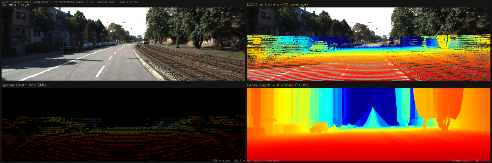
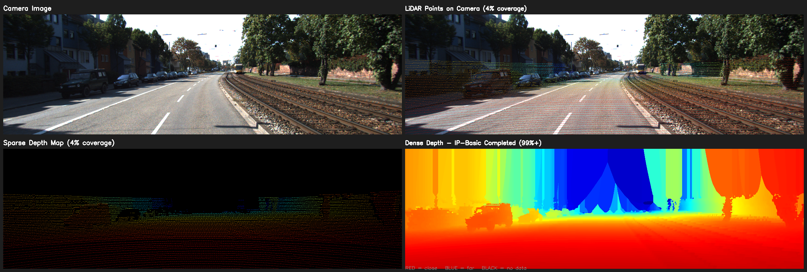
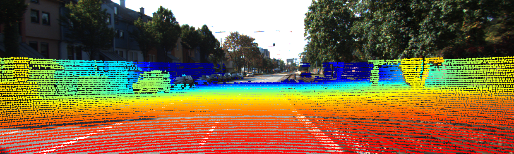
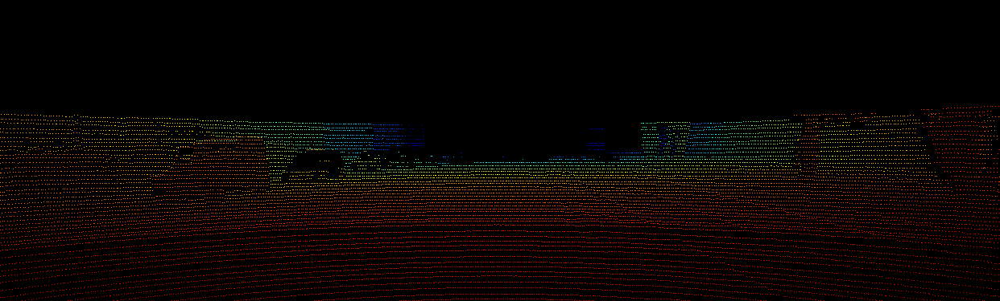
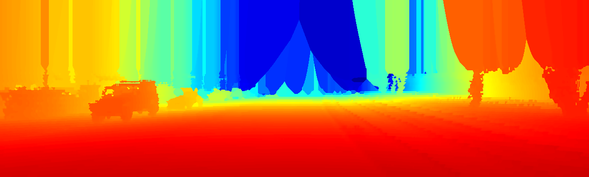
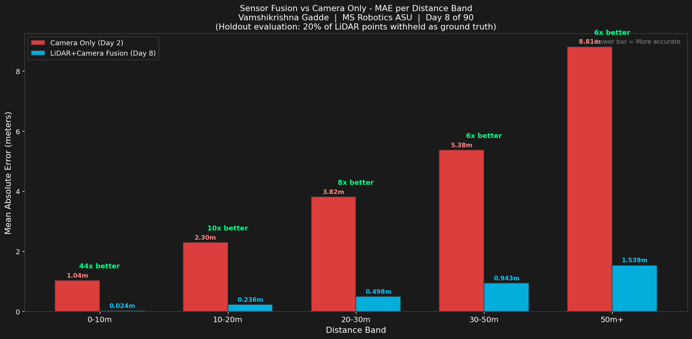

# Day 8: LiDAR-Camera Depth Completion

**Vamshikrishna Gadde | MS Robotics and Autonomous Systems, ASU, Dec 2026**

---

## The Problem

Day 2 proved cameras fail beyond 35m. Day 7 proved LiDAR fails in dense fog. Neither sensor is sufficient alone. They fail in completely different conditions. Day 8 fuses both to cover each other's failures.

---

## Live Demo: 108 KITTI Frames



*4-panel pipeline: camera image, LiDAR projection, sparse depth, dense completed depth.*

---

## Sparse vs Dense Depth







*4.1% LiDAR pixel coverage before completion.*



*100% coverage after completion.*

---

## Results: Sensor Fusion vs Camera Alone



| Distance Band | Camera Only (Day 2) | Fusion (Day 8) | Improvement |
|---|---|---|---|
| 0-10m | 1.039m MAE | 0.024m MAE | 44x better |
| 10-20m | 2.302m MAE | 0.236m MAE | 10x better |
| 20-30m | 3.819m MAE | 0.498m MAE | 8x better |
| 30-50m | 5.377m MAE | 0.943m MAE | 6x better |
| 50m+ | 8.813m MAE | 1.539m MAE | 6x better |

Evaluated using 80/20 holdout. 20% of LiDAR points withheld as ground truth, never seen by the algorithm. Honest numbers.

---

## Why Fusion Works

```
Camera:  dense image, no depth information
         error at 50m+ = 8.813m (Day 2)

LiDAR:   accurate depth, only 4.1% pixel coverage
         95.9% of pixels have no depth measurement

Fusion:  project LiDAR onto camera image
         use color similarity to fill gaps
         pixels with similar color to a nearby
         LiDAR point belong to the same surface
         same surface = similar depth

Result:  100% coverage with LiDAR-accurate depths
```

---

## The LiDAR Occlusion Shadow

Look at the sparse depth image. Some parked cars have zero LiDAR points.

```
LiDAR shoots laser pulses in straight lines.
Car A is in front of Car B.
Pulses hit Car A and return.
They never reach Car B.
Car B is in the laser shadow of Car A.
```

Depth completion assigns neighbor depth to occluded pixels. This can be wrong. Neural network completion learns to recognize object shapes and assigns plausible depths even without LiDAR hits. That is why deep learning fusion outperforms geometric methods.

---

## Algorithm: IP-Basic Depth Completion

```
INPUT: Sparse depth map (4.1% coverage)
    |
    v
Small dilation (3x3)
    Expands each LiDAR point outward
    Fills gaps between adjacent scan lines
    |
    v
Bilateral filter
    Smooths at object boundaries
    Camera color prevents wrong blending
    Wall at 30m stays separate from car at 8m
    |
    v
Large dilation (15x15)
    Fills medium holes between objects
    |
    v
Morphological closing (31x31)
    Fills round holes dilation misses
    |
    v
Global nearest-neighbor fill
    Every remaining pixel gets depth of
    nearest known LiDAR point
    Coverage goes from ~60% to 100%
    |
    v
Final bilateral filter

OUTPUT: Dense depth map (100% coverage)
```

---

## Performance

```
LiDAR input coverage:   4.1% of pixels
Dense output coverage:  100.0%
Completion time:        0.09s per frame
Frames processed:       108 KITTI frames
Evaluation method:      80/20 holdout
```

---

## What I Learned

The bilateral filter is what makes guided completion work. A naive fill would blur depth across object boundaries, assigning a car's depth to the wall behind it. The bilateral filter uses camera color to prevent this. Pixels with different colors get different weights. The depth stays sharp at boundaries without any explicit edge detection.

The 80/20 holdout evaluation matters more than it sounds. A biased evaluation uses all LiDAR points to fill, then checks the same points. Of course it scores well. Withholding 20% and never showing them to the algorithm gives you a number you can actually trust. The 44x improvement is real because it was measured honestly.

LiDAR occlusion shadows are a physical constraint no algorithm fully solves. Completion assigns plausible depth to shadowed regions but it is an educated guess. Understanding this is what motivates multi-LiDAR setups in production AV systems.

---

## Connection to the Series

```
Day 2: Camera alone fails at 35m+, MAE 8.813m
Day 7: LiDAR alone fails below 75m fog visibility
Day 8: Fuse both, 44x improvement at 0-10m, 6x at 50m+
```

---

## Run It

```bash
git clone https://github.com/GVK-Engine/day-008-depth-completion
cd day-008-depth-completion
pip install -r requirements.txt

py -3.11 projection.py    # project LiDAR onto camera
py -3.11 completion.py    # run IP-Basic completion
py -3.11 evaluate.py      # holdout evaluation
py -3.11 visualize.py     # 108-frame demo video and GIF
```

KITTI download: https://www.cvlibs.net/datasets/kitti/raw_data.php

---

## Stack

`Python 3.11` `NumPy` `OpenCV` `SciPy` `Matplotlib` `imageio` `KITTI`
